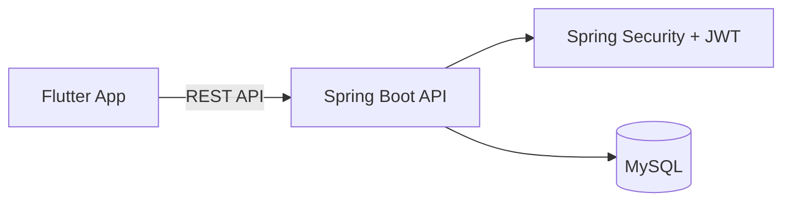

# 🏸 SMASH

**배드민턴 동아리 운영진의 반복 업무를 자동화하고, 흩어진 데이터를 중앙화하는 올인원 운영 관리 플랫폼**

---

## 📌 Project Overview

SMASH는 대학교 배드민턴 동아리 운영 과정에서 겪은 비효율적인 수작업을 해결하기 위해 기획된 운영 관리 서비스입니다. 기존의 분산된 도구(카카오톡, 엑셀, 구글 폼)를 통합하여 운영자는 효율적인 관리를, 부원은 편리한 참여를 할 수 있는 환경 구축을 목표로 합니다.

### 🔄 AS-IS vs TO-BE: 운영 효율화 비교

| 구분 | 도입 전 (AS-IS) | SMASH 도입 후 (TO-BE) |
| --- | --- | --- |
| **운영 데이터** | 카카오톡, 엑셀, 구글 폼 분산 | **중앙 데이터베이스(MySQL) 통합 관리** |
| **조 배정** | 수동 작성 및 수작업 공유 | **데이터 기반 자동화 지원** |
| **출석 집계** | 엑셀 수기 관리 및 누락 위험 | **이월 시스템 자동 계산 및 시각화** |
| **공지/투표** | 단체 채팅방 텍스트 공지 | **앱 내 투표 기능 및 알림 시스템 설계** |
| **정보 접근성** | 운영진만 확인 가능 | **부원 본인의 활동 내역 직접 확인** |

---

## 🎯 Core Features

### 🏸 Activity Management

동아리 운영 규칙을 반영한 활동 관리

- 일일 활동 투표 및 참여 유형(정규, 이월, 타조, 불참) 구분

### 🔄 Attendance Carry-over System

동아리의 월 활동 보장 규칙을 반영한 자동 출석 관리

- 활동 참여 기록 및 이월 대상 자동 관리

### 👥 Member Management

- 부원 정보 중앙 관리 및 가능 요일 기반 조 배정 관리

### 🚕 Transportation Management

- 활동 당일 이동 조율, 동행 그룹 관리 및 비용 부담 기록

---

## 🛠 Tech Stack

- **Frontend**: Flutter, Riverpod, Dio
- **Backend**: Java 21, Spring Boot 3.5, Gradle, Spring Security, JWT
- **Database**: MySQL

---

## 🧰 Development Tools

- Claude Code
- IntelliJ IDEA
- Visual Studio Code
- Git / GitHub

---

## 🏗 Architecture

---

## 🚀 Development Status

Status

- [x]  서비스 기획 및 요구사항 정의
- [x]  User Flow 설계
- [x]  ERD 설계
- [x]  API 설계
- [x]  Backend 개발
- [ ]  Frontend 개발
- [ ]  테스트 및 배포

---

## 🔮 Future Plan

- 운영 통계 Dashboard 제공
- Push Notification 시스템 추가
- 자동 조 배정 알고리즘 고도화
- 동아리별 커스터마이징 설정 지원

---

### ⚙️ Business Rule System

동아리 고유 운영 규칙을 반영한 도메인 로직 설계

- 월 활동 보장 횟수 관리
- 출석 이월 처리
- 정규/이월/타조 참여 구분
- 활동 기록 기반 운영 데이터 관리

---

## 👨‍💻 Developer

**김동현**

> 배드민턴 동아리 운영 경험을 바탕으로 문제 정의부터 서비스 설계, 개발까지 전 과정을 진행한 개인 프로젝트입니다.
> 

담당:

- 서비스 기획
- 사용자 흐름 및 화면 설계
- Backend / Frontend 개발
- Database 설계
- API 설계
- 비즈니스 로직 설계