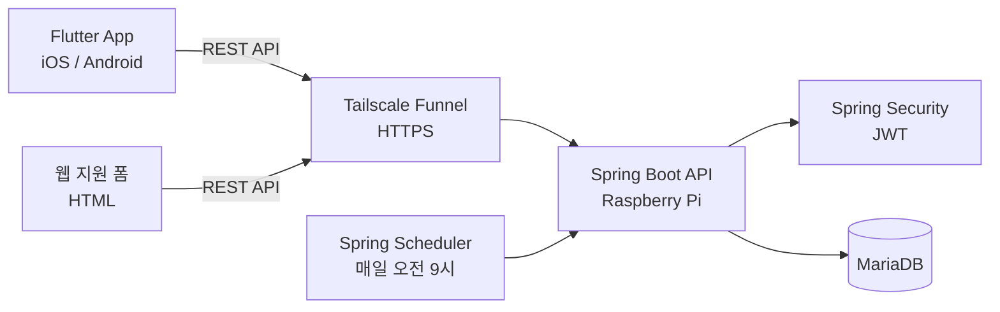

Readme · MD
# 🏸 SMASH
**배드민턴 동아리 운영진의 반복 업무를 자동화하고, 흩어진 데이터를 중앙화하는 올인원 운영 관리 플랫폼**
 
---
 
<p align="center">


</p>
## 📌 Project Overview
 
SMASH는 대학교 배드민턴 동아리 운영 과정에서 겪은 비효율적인 수작업을 해결하기 위해 기획된 운영 관리 서비스입니다. 기존의 분산된 도구(카카오톡, 엑셀, 구글 폼)를 통합하여 운영자는 효율적인 관리를, 부원은 편리한 참여를 할 수 있는 환경을 구축합니다.
 
> 동아리 부회장으로 2년간 직접 운영하며 느낀 불편함을 기반으로 기획 · 설계 · 개발까지 전 과정을 혼자 진행한 개인 포트폴리오 프로젝트입니다.
 
### AS-IS vs TO-BE
 
| 구분 | 도입 전 (AS-IS) | SMASH 도입 후 (TO-BE) |
| --- | --- | --- |
| **운영 데이터** | 카카오톡, 엑셀, 구글 폼 분산 | **중앙 데이터베이스 통합 관리** |
| **조 배정** | 수동 작성 및 수작업 공유 | **가능 요일 기반 자동 배정 알고리즘** |
| **출석 집계** | 엑셀 수기 관리 및 누락 위험 | **이월 시스템 자동 계산 및 시각화** |
| **공지/투표** | 단체 채팅방 텍스트 공지 | **앱 내 실시간 투표 기능** |
| **이동 조율** | 카카오톡으로 수동 파악 | **같이/따로 선택 + 택시 그룹 자동 배정** |
| **신입 모집** | 구글 폼 + 수동 등록 | **웹 지원 폼 + 합격 시 자동 등록** |
| **정보 접근성** | 운영진만 확인 가능 | **부원 본인의 활동 내역 직접 확인** |
 
---
 
## Core Features
 
### ✅ v1 — 핵심 운영 기능
 
#### 🗳️ 일일 활동 투표 시스템
- 매일 오전 9시 스케줄러가 당일 활동을 자동 생성 (Spring Scheduler)
- 부원은 정규참여 / 이월 / 타조참여 / 불참 중 선택
- 시간대별 투표 마감 자동 처리
- 서버 시작 시 당일 활동 누락 방지 (`@PostConstruct`)
#### 🔄 출석 이월(Carry-over) 시스템
- 동아리 고유 운영 규칙 반영: 월 보장 활동 횟수 내에서 다른 날짜로 이월 가능
- 이월 대상 후보 자동 계산 및 충족 여부 집계
- 이월 취소 시 기록 삭제 및 자동 복구
#### 👥 조 편성 및 자동 배정
- 부원의 가능 요일을 수집해 그리디 알고리즘으로 조 자동 배정
- 배정 미리보기 → 개별 수동 조정 → 확정의 3단계 프로세스
- 미배정자 개별 수동 배정 지원
#### 🏖️ 자유활동 기간 관리
- 시험기간 등 자유활동 기간을 다건 등록/삭제 가능
- 겹치는 기간 등록 시 서버에서 자동 거부
- 스케줄러가 자유활동 기간 여부를 확인해 `FREE` 타입으로 활동 자동 생성
#### 🎟️ 가입 코드 시스템
- 임원이 사전 등록(PENDING) → 부원이 가입코드로 직접 가입(ACTIVE) 전환
- 학기당 1개 코드 관리, 활성/비활성 토글, 재발급 지원
- 클립보드 복사 버튼으로 카카오톡 공유 편의성 제공
#### 📊 출석 현황 대시보드
- 조별 참여 현황, 미달자, 타조 참여 현황 3가지 탭으로 시각화
---
 
### ✅ v2 — 운영 편의 기능 확장
 
#### 🚕 이동 조율 시스템
- 활동 참여 시 이동 방법 선택 (같이/따로)
- 임원 전용 택시 그룹 배정 화면
  - 상단 호차 카드 선택 → 하단 명단에서 탭하여 즉시 배정
  - 정원 4명 제한, 호차 변경 시 확인 다이얼로그
- 부원 홈 화면에서 내 호차 및 동승자 확인
#### 🗳️ 일반 투표 시스템
- 임원이 회식/MT/자체대회 등 자유 주제로 투표 생성
- 익명/기명, 마감 시간 설정 또는 수동 종료 선택 가능
- 진행 중 / 종료된 투표 탭 구분, 투표 취소 후 재투표 지원
#### 💰 회비 관리
- 조별 탭으로 부원 납부 현황 확인
- 체크박스로 납부/취소 처리 (낙관적 업데이트)
- 전체 납부 진행률 시각화, 학기 종료 시 전체 초기화
#### 📋 동아리 지원 폼 시스템
- 임원이 앱에서 질문 추가/삭제/순서 변경 (TEXT/MULTILINE/SELECT 타입)
- 지원 기간 설정 (시작일시 ~ 마감일시), 폼 활성/비활성 토글
- 웹 지원 폼 (`apply.html`, 인증 불필요)
  - 고정 항목: 이름, 학번, 학과, 전화번호
  - 커스텀 질문: 임원이 추가한 질문들
  - 희망 활동 시간 선택 (요일/시간대)
  - QR코드로 접근 가능
- 중복 지원 방지 (학번 기준)
- 합격 처리 시 users 테이블 자동 등록 + member_availability 자동 등록
- 전체 합격 처리 (미처리 지원자 일괄 합격)
- 불합격 처리 / 불합격 취소
- 지원서 메모 타임라인 (임원 공유 메모)
- 엑셀 내보내기 (Apache POI)
#### 👤 부원 관리 강화
- 부원 상세 다이얼로그 (이름/학과/학번/전화번호/조/권한)
- 조 변경, MEMBER ↔ ADMIN 권한 변경
- 임원별 개인 메모 타임라인 (공유 X)
- 부원 삭제
#### ⚙️ 설정 페이지
- 내 정보 확인, 비밀번호 변경 (영문/숫자/특수문자 8자 이상)
- 앱 버전 정보, 로그아웃
---
 
## Tech Stack
 
| 분류 | 기술 |
| --- | --- |
| **Frontend** | Flutter 3, Riverpod, Dio, go_router, flutter_secure_storage, qr_flutter, flutter_file_saver |
| **Backend** | Java 21, Spring Boot 3.5, Gradle, Spring Security, JWT, Spring Scheduler, Apache POI |
| **Database** | MariaDB 11.8 (MySQL 호환) |
| **Infra** | Raspberry Pi 4, Tailscale Funnel (HTTPS 공개), systemd 자동 시작 |
| **Test** | JUnit5, Mockito, AssertJ, H2 (인메모리) |
| **Design** | Pretendard 폰트, 자체 디자인 시스템 (AppColors, AppTheme) |
 
---
 
## Development Tools
- Claude AI (기획 · 설계 · 개발 전반)
- IntelliJ IDEA (백엔드)
- Android Studio (Flutter)
- Git / GitHub (모노레포)
---
 
## Architecture
 

```mermaid
flowchart LR
    APP[Flutter App\niOS / Android]
    WEB[웹 지원 폼\nHTML]
    FUNNEL[Tailscale Funnel\nHTTPS]
    API[Spring Boot API\nRaspberry Pi]
    SEC[Spring Security\nJWT]
    DB[(MariaDB)]
    SCHED[Spring Scheduler\n매일 오전 9시]
 
    APP -->|REST API| FUNNEL
    WEB -->|REST API| FUNNEL
    FUNNEL --> API
    API --> SEC
    API --> DB
    SCHED --> API
```
 
---
 
## Project Structure
 
```
smash/
├── backend/app/
│   └── src/main/java/com/smash/
│       ├── api/
│       │   ├── auth/
│       │   ├── activity/
│       │   ├── attendance/
│       │   ├── group/
│       │   ├── invite/
│       │   ├── schedule/
│       │   ├── assignment/
│       │   ├── poll/
│       │   ├── dues/
│       │   ├── transport/
│       │   ├── application/
│       │   └── admin/
│       ├── domain/
│       │   ├── user/          (User, MemberNote)
│       │   ├── activity/
│       │   ├── group/
│       │   ├── invite/
│       │   ├── participation/
│       │   ├── availability/
│       │   ├── poll/
│       │   ├── dues/
│       │   ├── transport/
│       │   ├── application/   (ApplicationForm, FormQuestion, Application,
│       │   │                   ApplicationAnswer, ApplicationMemo)
│       │   └── token/
│       ├── scheduler/
│       ├── auth/
│       └── config/
│
└── frontend/app/
    └── lib/
        ├── core/
        │   ├── api/
        │   ├── storage/
        │   ├── theme/
        │   └── constants/
        └── features/
            ├── auth/
            └── home/
```
 
---
 
## ERD (21개 테이블)
 
```
users ──── participation ──── activity ──── club_groups
            │                               │
            └── member_availability         └── activity_schedule
            └── member_note
 
polls ──── poll_options ──── poll_votes
 
transport_group ──── transport_member
 
application_form ──── form_question
application ──── application_answer
            └── application_memo
 
dues_payment
invite_code / free_period / refresh_token
```
 
---
 
## 📱 화면 구성
 
### 공통 (하단 바)
| 탭 | 내용 |
| --- | --- |
| 홈 | 오늘 활동 카드 (이동방법 선택/내 호차 확인) + 진행 중인 투표 카드 |
| 투표 | 진행 중 / 종료된 투표 탭 구분 |
| 더보기 | 설정 페이지 연결 |
 
### 임원 전용 Drawer (8개 메뉴)
| 메뉴 | 기능 |
| --- | --- |
| 지원 폼 관리 | 질문 추가/삭제/순서 변경, 기간 설정, QR코드 |
| 지원서 관리 | 지원서 목록/상세, 메모, 합격/불합격/전체합격, 엑셀 내보내기 |
| 회비 관리 | 조별 납부 현황, 체크박스 처리, 초기화 |
| 가입코드 관리 | 발급, 재발급, 활성/비활성 토글, 복사 |
| 부원 관리 | 부원 목록/상세/조변경/권한변경/개인메모, 조 편성, 자동 배정 |
| 정규활동 일정 | 요일별 활성/비활성 스위치 |
| 날짜별 활동 관리 | 활동 취소/복구, 자유활동 전환 |
| 자유활동 기간 설정 | 기간 다건 등록/삭제, 겹침 검증 |
 
---
 
## Infra & Deployment
 
- **서버**: Raspberry Pi 4 (ARM64, Raspberry Pi OS)
- **DB**: MariaDB (MySQL 호환)
- **외부 공개**: Tailscale Funnel (HTTPS)
- **자동 시작**: systemd 서비스
- **웹 지원 폼**: `https://baki.tailbdb322.ts.net/apply.html`
- **배포 방법**:
```bash
  git push origin main
  ~/deploy.sh  # 라즈베리파이
```
 
---
 
## 주요 트러블슈팅
 
### boolean vs Boolean — Jackson 역직렬화 버그
**문제**: 가입코드 활성화/비활성화 토글이 항상 `false`로만 처리되는 버그  
**원인**: `boolean` primitive 타입에서 Lombok이 생성하는 getter 이름이 `setActive()`가 되어 Jackson이 `setIsActive()`를 찾지 못함  
**해결**: `boolean` → `Boolean` 래퍼 클래스로 변경
 
### JPA N+1 문제 해결
**문제**: 오늘 활동 목록 조회 시 활동 수에 비례해 쿼리가 2N+1번 발생  
**해결**: `@EntityGraph`로 group을 JOIN 조회, Participation은 IN 쿼리로 일괄 조회 후 Map으로 변환  
**결과**: 쿼리 수 2N+1 → 3번(고정)으로 개선
 
### isActive 직렬화 — Jackson boolean getter 네이밍 버그
**문제**: 서버 응답에서 `isActive`가 `active`로 내려와 Flutter에서 파싱 실패  
**해결**: `@JsonProperty("isActive")`를 명시한 getter를 직접 작성
 
### MariaDB 마이그레이션
**문제**: 라즈베리파이(ARM64)에서 MySQL 패키지를 찾을 수 없음  
**해결**: `mariadb-server` 설치, JDBC URL 및 드라이버 변경
 
### Enum 충돌 — java.time.DayOfWeek vs 커스텀 DayOfWeek
**문제**: 지원 폼 제출 시 `"MON"` 값이 Java 표준 `DayOfWeek`로 역직렬화되어 파싱 실패  
**해결**: import를 `com.smash.domain.group.DayOfWeek`로 변경
 
### 외래 키 제약 — 지원자 삭제
**문제**: users 삭제 시 member_availability 외래 키 제약으로 실패  
**해결**: member_availability 먼저 삭제 후 users 삭제
 
---
 
## 추후 계획
 
### 배포 및 인프라
- Raspberry Pi → **AWS 마이그레이션** (EC2 + RDS)
- **CI/CD 파이프라인** 구축 (GitHub Actions)
- **TestFlight / 앱스토어 배포**
### 기능 추가
- **Push Notification** (FCM)
  - 투표 마감 1시간 전 알림
  - 회비 미납자 알림
  - 신규 지원자 알림
- **택시비 정산** 기능 (결제자가 계좌/금액 입력 → N빵 자동 계산)
### 품질 개선
- **UI/UX 다듬기** (전반적인 디자인 일관성 개선)
- **버그 수정** 및 엣지 케이스 처리
- **테스트 커버리지 확대** (현재 25개 → 목표 50개+)
---
 
## Development Status
 
**v1 (완료)**
- [x] 서비스 기획 및 요구사항 정의
- [x] ERD 설계 (8개 테이블)
- [x] API 설계 및 개발 (Spring Boot)
- [x] Flutter 앱 개발
- [x] 디자인 시스템 적용 (Pretendard, AppTheme)
- [x] 실서버 배포 (Raspberry Pi + Tailscale Funnel)
- [x] iOS / Android 배포
- [x] JUnit5 + Mockito 단위/통합 테스트 (25개)
- [x] N+1 문제 해결 (@EntityGraph + IN 쿼리)

**v2 (완료)**
- [x] 일반 투표 기능
- [x] 회비 관리
- [x] 이동 조율 시스템 (같이/따로, 택시 그룹 배정)
- [x] 설정 페이지
- [x] 동아리 지원 폼 시스템 (웹 폼 + QR코드 + 엑셀 내보내기)
- [x] 지원서 메모 타임라인
- [x] 부원 상세 다이얼로그 (정보/조변경/권한변경/개인메모)
- [x] Drawer 메뉴 정리 (13개 → 8개)
- [x] 테이블 21개, API 81개, 테스트 25개

**v3 (예정)**
- [ ] AWS 마이그레이션
- [ ] CI/CD 파이프라인
- [ ] Push Notification
- [ ] 택시비 정산
- [ ] TestFlight / 앱스토어 배포
- [ ] UI/UX 개선 및 버그 수정
---
 
## 👨‍💻 Developer
 
**김동현** · GitHub: [@kor-BaKi](https://github.com/kor-BaKi)
 
> 배드민턴 동아리 운영 경험을 바탕으로 문제 정의부터 서비스 설계, 개발, 배포까지 전 과정을 진행한 개인 프로젝트입니다.
 
**담당 영역**
- 서비스 기획 및 사용자 흐름 설계
- ERD 및 API 설계
- 백엔드 개발 (Spring Boot)
- 프론트엔드 개발 (Flutter)
- 디자인 시스템 구축
- 인프라 구성 및 배포 (Raspberry Pi)
 
