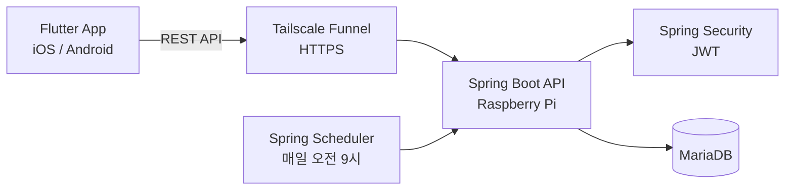

# 🏸 SMASH
**배드민턴 동아리 운영진의 반복 업무를 자동화하고, 흩어진 데이터를 중앙화하는 올인원 운영 관리 플랫폼**

---

<p align="center">


</p>

## 📌 Project Overview

SMASH는 대학교 배드민턴 동아리 운영 과정에서 겪은 비효율적인 수작업을 해결하기 위해 기획된 운영 관리 서비스입니다. 기존의 분산된 도구(카카오톡, 엑셀, 구글 폼)를 통합하여 운영자는 효율적인 관리를, 부원은 편리한 참여를 할 수 있는 환경을 구축합니다.

> 동아리 부회장으로 2년간 직접 운영하며 느낀 불편함을 기반으로 기획 · 설계 · 개발까지 전 과정을 혼자 진행한 개인 포트폴리오 프로젝트입니다.

### 🔄 AS-IS vs TO-BE

| 구분 | 도입 전 (AS-IS) | SMASH 도입 후 (TO-BE) |
| --- | --- | --- |
| **운영 데이터** | 카카오톡, 엑셀, 구글 폼 분산 | **중앙 데이터베이스 통합 관리** |
| **조 배정** | 수동 작성 및 수작업 공유 | **가능 요일 기반 자동 배정 알고리즘** |
| **출석 집계** | 엑셀 수기 관리 및 누락 위험 | **이월 시스템 자동 계산 및 시각화** |
| **공지/투표** | 단체 채팅방 텍스트 공지 | **앱 내 실시간 투표 기능** |
| **정보 접근성** | 운영진만 확인 가능 | **부원 본인의 활동 내역 직접 확인** |

---

## 🎯 Core Features

### 🗳️ 일일 활동 투표 시스템
- 매일 오전 9시 스케줄러가 당일 활동을 자동 생성 (Spring Scheduler)
- 부원은 정규참여 / 이월 / 타조참여 / 불참 중 선택
- 시간대별 투표 마감 자동 처리 (1-3시 조 → 13:00, 3-5시 조 → 15:00)
- 서버 시작 시 당일 활동 누락 방지 (`@PostConstruct`)

### 🔄 출석 이월(Carry-over) 시스템
- 동아리 고유 운영 규칙 반영: 월 보장 활동 횟수 내에서 다른 날짜로 이월 가능
- 이월 대상 후보 자동 계산 및 충족 여부 집계
- 이월 취소 시 기록 삭제 및 자동 복구

### 👥 조 편성 및 자동 배정
- 부원의 가능 요일을 수집해 그리디 알고리즘으로 조 자동 배정
- 배정 미리보기 → 개별 수동 조정 → 확정의 3단계 프로세스
- 미배정자 개별 수동 배정 지원

### 🏖️ 자유활동 기간 관리
- 시험기간 등 자유활동 기간을 다건 등록/삭제 가능
- 겹치는 기간 등록 시 서버에서 자동 거부
- 스케줄러가 자유활동 기간 여부를 확인해 `FREE` 타입으로 활동 자동 생성

### 🎟️ 가입 코드 시스템
- 임원이 사전 등록(PENDING) → 부원이 가입코드로 직접 가입(ACTIVE) 전환
- 학기당 1개 코드 관리, 활성/비활성 토글, 재발급 지원

### 📊 출석 현황 대시보드
- 조별 참여 현황, 미달자, 타조 참여 현황 3가지 탭으로 시각화

---

## 🛠 Tech Stack

| 분류 | 기술 |
| --- | --- |
| **Frontend** | Flutter 3, Riverpod, Dio, go_router, flutter_secure_storage |
| **Backend** | Java 21, Spring Boot 3.5, Gradle, Spring Security, JWT, Spring Scheduler |
| **Database** | MariaDB 11.8 (MySQL 호환) |
| **Infra** | Raspberry Pi 4, Tailscale Funnel (HTTPS 공개), systemd 자동 시작 |
| **Design** | Pretendard 폰트, 자체 디자인 시스템 (AppColors, AppTheme) |

---

## 🧰 Development Tools

- Claude AI (기획 · 설계 · 개발 전반)
- IntelliJ IDEA (백엔드)
- Android Studio (Flutter)
- Git / GitHub (모노레포)

---

## 🏗 Architecture


```mermaid
flowchart LR
    APP[Flutter App\niOS / Android]
    FUNNEL[Tailscale Funnel\nHTTPS]
    API[Spring Boot API\nRaspberry Pi]
    SEC[Spring Security\nJWT]
    DB[(MariaDB)]
    SCHED[Spring Scheduler\n매일 오전 9시]

    APP -->|REST API| FUNNEL
    FUNNEL --> API
    API --> SEC
    API --> DB
    SCHED --> API
```

---

## 📁 Project Structure

```
smash/
├── backend/app/               # Spring Boot
│   └── src/main/java/com/smash/
│       ├── api/               # Controller, Service, DTO
│       │   ├── auth/
│       │   ├── activity/
│       │   ├── attendance/
│       │   ├── group/
│       │   ├── invite/
│       │   ├── schedule/
│       │   └── assignment/
│       ├── domain/            # Entity, Repository
│       │   ├── user/
│       │   ├── activity/
│       │   ├── group/
│       │   ├── invite/
│       │   ├── participation/
│       │   ├── availability/
│       │   └── token/
│       ├── scheduler/         # ActivityScheduler
│       ├── auth/              # JwtProvider, Filter
│       └── config/            # SecurityConfig, SwaggerConfig
│
└── frontend/app/              # Flutter
    └── lib/
        ├── core/
        │   ├── api/           # Dio API 클라이언트 (9개)
        │   ├── storage/       # flutter_secure_storage
        │   ├── theme/         # AppTheme, AppColors
        │   └── constants/
        └── features/
            ├── auth/          # 로그인, 회원가입
            └── home/          # 부원/임원 전체 화면 (12개)
```

---

## 🗄 ERD (8개 테이블)

```
User ──── Participation ──── Activity ──── Group
           │                               │
           └── CarryoverTarget             └── ActivitySchedule
                                           
InviteCode / FreePeriod / MemberAvailability / RefreshToken
```

---

## 📱 화면 구성

### 공통
- 로그인 / 회원가입
- 홈 화면 (오늘 활동 카드 — 정규/자유/타조/마감 상태별 UI 분기)
- 가능 요일 제출 (미배정 부원)

### 임원 전용 (Drawer)
| 메뉴 | 기능 |
| --- | --- |
| 가입코드 관리 | 발급, 재발급, 활성/비활성 토글 |
| 지원자 관리 | 사전 등록, 불합격 처리, 복구 |
| 조 편성 관리 | 조 생성, 조장 지정, 조원 조회 |
| 자동 배정 | 미리보기, 개별 조정, 확정 |
| 정규활동 일정 | 요일별 활성/비활성 스위치 |
| 날짜별 활동 관리 | 활동 취소/복구, 자유활동 전환 |
| 자유활동 기간 | 기간 다건 등록/삭제, 겹침 검증 |
| 출석 현황 | 조별/미달자/타조참 3탭 대시보드 |

---

## 🚀 Infra & Deployment

- **서버**: Raspberry Pi 4 (ARM64, Raspberry Pi OS)
- **DB**: MariaDB (MySQL 호환, JDBC mariadb-java-client 사용)
- **외부 공개**: Tailscale Funnel (HTTPS, Let's Encrypt 인증서 자동 발급)
- **자동 시작**: systemd 서비스로 서버 재부팅 시 자동 실행
- **배포 방법**:
  ```bash
  # 맥에서
  git push origin main

  # 라즈베리파이에서
  ~/deploy.sh
  ```
- **iOS 배포**: Xcode Personal Team으로 기기 직접 설치 (7일 주기 갱신)
- **Android 배포**: APK 파일 직접 공유

---

## 🐛 주요 트러블슈팅

### boolean vs Boolean — Jackson 역직렬화 버그
**문제**: 가입코드 활성화/비활성화 토글이 항상 `false`로만 처리되는 버그 발생  
**원인**: `InviteCodeToggleRequest`의 `isActive` 필드가 Java `boolean` primitive로 선언되어 있어, Lombok `@Setter`가 생성하는 setter 이름이 `setActive()`가 됨. Jackson은 JSON 키 `"isActive"`에 대응하는 `setIsActive()`를 찾지 못해 파싱에 실패하고 primitive 기본값인 `false`를 유지함  
**해결**: `boolean` → `Boolean` 래퍼 클래스로 변경. `Boolean` 타입은 Lombok이 `setIsActive()`를 정확히 생성하여 Jackson 매핑 성공  
**배운 점**: 에러 없이 200 OK가 반환되더라도 실제 값이 무시될 수 있음. 네트워크 레이어 단계별 로깅이 가장 빠른 디버깅 수단

### isActive 직렬화 — Jackson boolean getter 네이밍 버그
**문제**: 서버 응답에서 `isActive`가 `active`로 내려와 Flutter에서 파싱 실패  
**원인**: Lombok `@Getter`가 `boolean isActive` 필드에 `isActive()`라는 getter를 생성하고, Jackson이 `is` 접두사를 제거해 `active`로 직렬화  
**해결**: `@Getter` 제거 후 `@JsonProperty("isActive")`를 명시한 getter를 직접 작성  

### MariaDB 마이그레이션
**문제**: 라즈베리파이(ARM64)에서 MySQL 패키지를 찾을 수 없음  
**원인**: ARM 아키텍처의 Debian 저장소는 MySQL 대신 MariaDB를 제공  
**해결**: `mariadb-server` 설치, JDBC URL `jdbc:mysql` → `jdbc:mariadb`, 드라이버 `mysql-connector-j` → `mariadb-java-client`로 교체

---

## 🔮 Future Plan

- Push Notification 시스템
- 운영 통계 Dashboard
- 자동 조 배정 알고리즘 고도화
- 동아리별 커스터마이징 설정 지원
- CI/CD 파이프라인 구축 (GitHub Actions)

---

## 🚀 Development Status

**v1 (완료)**
- [x] 서비스 기획 및 요구사항 정의
- [x] User Flow 설계
- [x] ERD 설계 (8개 테이블)
- [x] API 설계 (31개 엔드포인트)
- [x] Backend 개발 (Spring Boot)
- [x] Frontend 개발 (Flutter)
- [x] 디자인 시스템 적용 (Pretendard, AppTheme)
- [x] 실서버 배포 (Raspberry Pi + Tailscale Funnel)
- [x] iOS / Android 배포
- [x] JUnit5 + Mockito 단위/통합 테스트 (23개)

**v2 (진행 중)**
- [x] 투표 기능 (임원 생성, 부원 참여/취소, 결과 확인)
- [x] 부원 관리 화면 (조 확인 및 변경)
- [x] 가입코드 복사 버튼
- [ ] TestFlight / 스토어 배포

---

## 👨‍💻 Developer

**김동현** · GitHub: [@kor-BaKi](https://github.com/kor-BaKi)

> 배드민턴 동아리 운영 경험을 바탕으로 문제 정의부터 서비스 설계, 개발, 배포까지 전 과정을 진행한 개인 프로젝트입니다.

**담당 영역**
- 서비스 기획 및 사용자 흐름 설계
- ERD 및 API 설계
- 백엔드 개발 (Spring Boot)
- 프론트엔드 개발 (Flutter)
- 디자인 시스템 구축
- 인프라 구성 및 배포 (Raspberry Pi)
